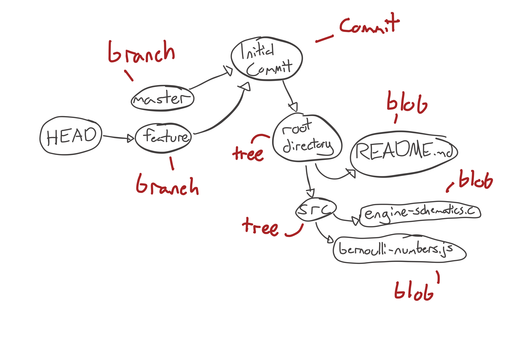
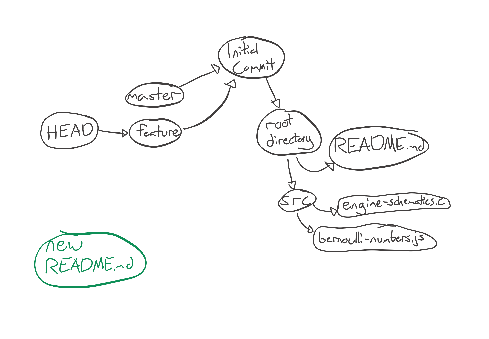
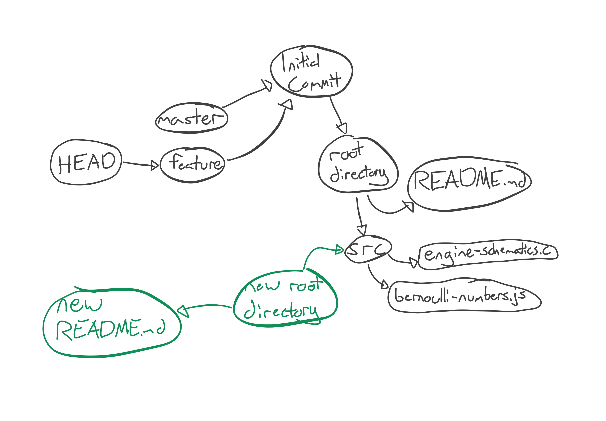
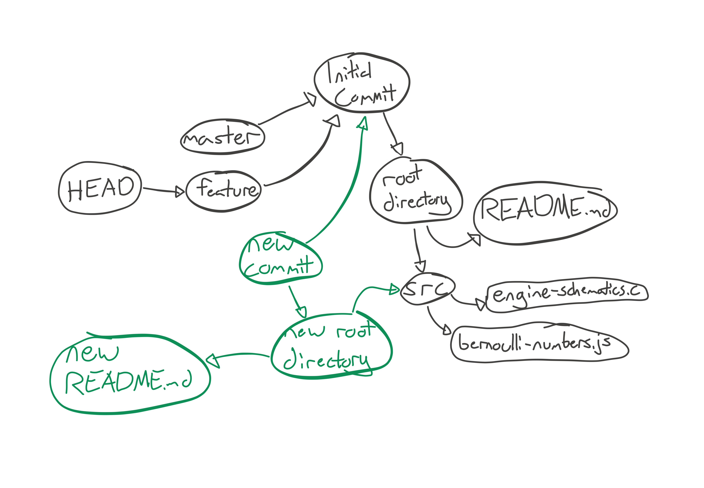
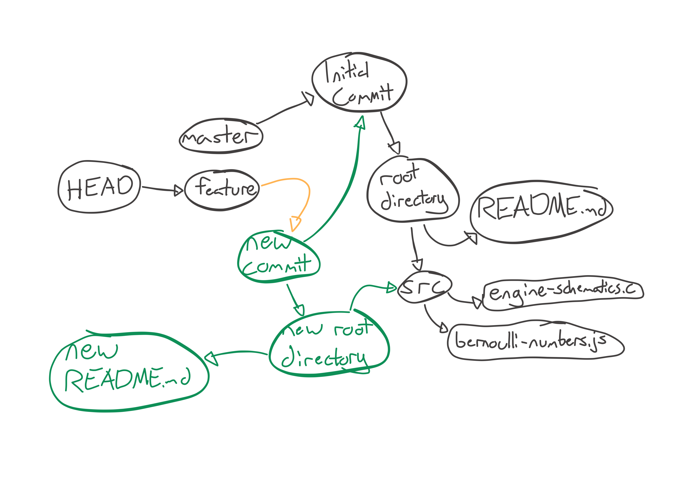

# The Guts of Git

During the renaissance it became popular for great artists to dissect human corpses.  Michelangelo and da Vinci both took part in the dissecting of man. Art requires an intimate knowledge of the subject in order to faithfully reproduce it, and there aren't many better ways to understand something than by taking it apart.

So it is with software. Today we are gonna be tearing out the guts of git and looking at them for ourselves so we may too become like the masters.

### The Content Database

At the very core of git is a content addressed database (or filesystem, or memory, or whatever). I'm going to be calling this a CAD. To understand what is going on with git it is really important to understand what a content addressed database is. Fortunately they are pretty simple.

First lets look at what "Content" means. This is simple. The content in a content addressed database is literally any kind of data. Just a sequence of 1's and 0's. Any pile of bits will do.

So what does it mean to address content? If I address you, that means I've said your name or provided some other indication, some identifier, that it is you I'm addressing. I'm talkin to ya. An address is just a unique way of identifying something. Address books uniquely identify houses. Etc.

So if content is a sequence of 1's and 0's, the address of some content is a unique way of referring to that data. In what manner might we accomplish that? Hashes! Any sort of hash will do as long as it satisfies all the properties of a good hashing function but for our purposes lets use the sha1 hash.

The database part simply means we have a method for finding content based on its hash.

Alright so we have a lookup table that correlates hashes with data. This has some nice properties.

First, we don't have to trust the database for data integrity. When we request some data from the database and we get the data back we can run our hashing algorithm against the hash we had stored and check if they match. So content addressed memory doesn't require any trust between the client and the server. Except maybe that the client will desire that the server doesn't delete their data. So maybe a bit of trust.

It also means that data is immutable in the database. The store is extremely simple, supporting only two operations. Add a blob of data and retrieve a blob of data by hash. There are no mutation operations here.

Of course it is so simple that figuring out how to use a CAD appropriately takes some work. But git shows us how.

### What is git used for?

Ok so real quick aside: we need to remember what the essential purpose of git is. What operations do we want it to support? Because that all determines how git can work with a CAD.

The real essence of a version control system (VCS, how many acronyms can we pack in this essay?) is it should allow us to look back into the history of a project, see how the new version differs from whatever past versions we have, let us revert to previous versions of our codebase, and ideally allow us to work nicely with others.

A big part of this means that a VCS is about recreating snapshots for different moments in history of our project. This is actually super simple in theory: we could copy EVERYTHING in a project whenever we take a snapshot and save it to a tarball or something and tag the tarball with the previous version and some note to let us know what the tarball meant. Then to retrieve previous versions we can unpack the tarball and voila we have the previous version. But that is really inefficient especially when we want to make small changes at a time. So the trick to building a good version control system is to make these snapshots efficient while still allowing one to construct the entire state of the repo.

### Proof

One more aside: if you want to follow along you can look into the guts with the `cat-file` command; this one lists all the objects in a repo along with their types

```shell
git cat-file --batch-check --batch-all-objects
```

and this one grabs a file by hash

```shell
git cat-file -p $HASH
```

I'd encourage you to experiment with these for a bit. Run the first command to list all the objects in the repo of some project you are familiar with. Then take one of those objects at random and run its hash through the second command. Look for patterns.

You can also sort of see the structure of the repo by looking in `.git/objects/` but I recommend using the `cat-file` command because otherwise you'll have to look at compressed objects in packfiles and their indexes and some other nonsense.

### Blobs, Trees, and Commits

Git uses its CAD for 3 types of objects. Remember we are keeping things simple here so we aren't using 3 separate CADs, one for each type of object. Everything goes into the one CAD.

Commits are a snapshot of a repo. From a commit you should be able to recreate the ENTIRE state of the project at that point in time. In addition to the data needed to reconstruct the state of the repo at a moment in time commits include information on the history of the project up until that commit by referencing parent commits (a single commit can reference multiple parents; this happens in the case of a merge. Or none in the case of the initial commit). And commits have a little bit of data that is useful like commit author and message (and committer, which is almost never distinct from commit author). A sample:

```
tree 8d69b7df5fa3bb43671f9cf34e3674dec4fad311
parent 13d7893577cedbceed7a364d050c11aa3cfea1ee
author Ada Lovelace <alovlace@analytical.engine> 1674337023 -0700
committer Ada Lovelace <alovlace@analytical.engine> 1674337023 -0700

Finished translation of the algorithm to javascript.
```

Btw I mentioned that a commit references one or more parents. How does it do this? Through the CAD! The commit holds a sha1 hash for each parent commit, so to look back in time you simply grab the parent sha1 address from the commit object and then look the parent up in the CAD. Repeat ad infinitum to go back to the big bang.

Ok so how can you "reconstruct" an entire project state from a commit? To do this you need ALL the data that may have been present; you need a full directory heirarchy.

The second type of object git stores in the CAD is just this: the tree type. A tree is simple; it is just a list of references to blobs (I'll get there in a sec) and other trees, along with some permissions data and filenames. Imagine we had the following project structure:

 ```
.
├── README.md
└── src
    ├── engine-schematics.c
    └── bernoulli-numbers.js
 ```

the corresponding tree would look something like

```
100644 blob c2226816b4eeaf4cd22bbca0b69d084dfc49c8af	README.md
040000 tree 084f97465213fd702411f144fac54b13ff351430	src
```

Wait theres only two things here? Nah just look at the src object, which can be retrieved from the CAD using its hash, and you'll see something like

```
100644 blob a9340b122ae22ca82be607c6abc9fc35af57de33	engine-schematics.c
100644 blob 9c63c22bf2335c96ab74fc41c549aefafa38253a	bernoulli-numbers.js
```

Alright so commits point to previous commits and to trees. The trees can be used to reconstruct the entirety of a commit; or at least the filesystem layout at the time of commit.

And now for the simplest type of data in the git CAD: the blob. A blob can be ANYTHING, look inside a blob and you will simply see your source files.

To recap. A commit is a repo snapshot. Commits link to previous commits and to a tree. The tree represents a directory. In each tree is a list of links to other trees and blobs along with the file name and permissions at time of commit. And a blob is any kind of data.

### The creature in motion

I don't think this description is complete without seeing how this all plays out when new files are committed. That should help tie up any loose ends about the reasoning for this design.

But before we do that we have to introduce one last concept: references.

All the above works great but if you are just looking at a repo as a list of objects by hash you will have no idea what to do. A big project can get well beyond the thousands of objects in a repository; if you want the latest version of a project, or to try out an experimental branch, or to do anything else, where on earth should you start?

References provide the answer. These live outside the CAD; they are just files that hold the index (hash) of an object within the CAD. They are mostly used to know what the latest state for different branches are, though they are also used for things like tagging releases. `git show-ref` lists all the references in a git repo along with the corresponding commit hashes.

And with an understanding of references we can now see what happens when we modify a file and commit the changes we've made. Lets use the previous example:

```
.
├── README.md
└── src
    ├── engine-schematics.c
    └── bernoulli-numbers.js
```

To keep things simple let's pretend like this is about to be only the second commit ever to this project. The current state of the repo will look something like this:


And with annotations so you can see what these different object types are



We've made a change to the readme. So we add that to the CAD



But the new readme means we need a new tree



With the new tree we can add the new commit



And finally update the reference



We are now done. The commit is done! We've updated our repo. We can always go back by finding the previous commit and restoring the tree.

Notice how the only thing that got modified was the reference. Everything else was just added to. Pretty neat.

Also notice that we added a completely new copy of the readme. It is a common misconception (that I held until like a week ago) that git stores file differences in order to save space. But it doesn't (caveat needed: sometimes git will compress objects in the CAD into what are known as pack files, where it will use file diffs to save space. But this doesn't change the basic semantics of the CAD itself).

### Conclusion

Git is built on top of a content addressed database. This database holds three kinds of objects: commits, trees, and blobs. Commits link to trees and previous commits. Trees link to trees and blob. References point to interesting commits.

If you understand this summary then you should understand nearly everything there is to know about git. Most of the git documentation and commands should not only be understandable to you, but you should be able to nearly reproduce for yourself. Or at least imagine the implementation.

The real reason I ended up writing about all this was because I was interested in the git CAD and ended up writing a little [app to turn the objects in a git CAD into a website](https://github.com/seanlucrussell/object-explorer). Since commits link to trees and trees link to trees and trees link to blobs and commits link to commits I figured the web would provide a nice way to explore a git repo.

Just remember: the heart has four chambers, the spine has thirty three vertebrae, and git is built on a content addressed database. And you'll do just fine.
